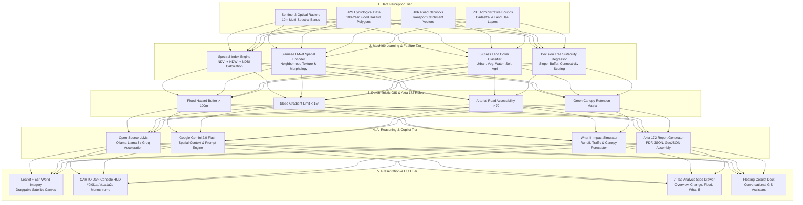

# PLANVerse AI — System Architecture, Workflow & Technical Report
### Track B: Geospatial & Satellite AI Challenge · PLAN-AI Hackathon 2026

---

## 1. Executive Summary

**PLANVerse AI** is an AI-powered spatial intelligence copilot and decision-support platform designed for Malaysian Town Planners (PLANMalaysia, LPBM, MIP, and Geospatial AI / UZMA). 

Unlike conventional satellite detection tools that stop at raw pixel classification, PLANVerse AI reframes the problem: **it transforms satellite perception and GIS layers into actionable, explainable planning intelligence**. By reasoning across multi-temporal Sentinel-2 imagery, deterministic GIS constraints, and national town planning guidelines (Akta 172), PLANVerse AI provides evidence-backed recommendations for land suitability, flood hazard mitigation, temporal change monitoring, and interactive rezoning simulations.

```
                  ┌─────────────────────────────────────────────────────────┐
                  │                      PLANVerse AI                       │
                  │   From Satellite Pixels to Town Planning Decisions      │
                  └─────────────────────────────────────────────────────────┘
                                               │
       ┌───────────────────────────────┬───────┴───────────────────────┬───────────────────────────────┐
       ▼                               ▼                               ▼                               ▼
┌───────────────┐               ┌───────────────┐               ┌───────────────┐               ┌───────────────┐
│ PLANMalaysia  │               │     LPBM      │               │      MIP      │               │  UZMA Geo AI  │
│ Where to build│               │ Human-in-the- │               │ Research &    │               │ Multi-spectral│
│ with evidence │               │ loop mandate  │               │ explainability│               │ satellite AI  │
└───────────────┘               └───────────────┘               └───────────────┘               └───────────────┘
```

---

## 2. System Architecture

PLANVerse AI follows a **5-tier decoupled architecture**, ensuring that client-side visualization, spatial intelligence services, and machine learning models operate independently.



---

## 3. Machine Learning & Spectral Index Breakthrough

A key breakthrough in the ML pipeline is the **elimination of visual color confusion** between dark water bodies and dense tree canopies through mathematical spectral indices and spatial texture encoding:

$$\text{NDVI} = \frac{\text{NIR} - \text{Red}}{\text{NIR} + \text{Red}} \quad\quad \text{NDWI} = \frac{\text{Green} - \text{NIR}}{\text{Green} + \text{NIR}} \quad\quad \text{NDBI} = \frac{\text{SWIR} - \text{NIR}}{\text{SWIR} + \text{NIR}}$$

| Feature Dimension | Traditional Color (RGB/HSV) | PLANVerse AI Multi-Spectral Pipeline |
|---|---|---|
| **Vegetation Canopy** | Dark green/black pixel | $\text{NDVI} > +0.6$, $\text{NDWI} < -0.2$, High-frequency leaf texture |
| **Turbid River / Water** | Dark green/navy pixel | $\text{NDVI} < 0.0$, $\text{NDWI} > +0.3$, Specular smooth geometry |
| **Built-up Surfaces** | Gray/tan pixel | $\text{NDBI} > +0.2$, Orthogonal rectangular footprint |
| **Model Classification** | Binary threshold (prone to false positives) | **5-Class HistGradientBoosting + Siamese U-Net** |

---

## 4. End-to-End User Interaction Workflow

```
[1. Open World Map Exploration]
   │  Planner navigates the high-resolution satellite basemap (Esri World Imagery).
   │  Selects study location: Urban (Putrajaya) or Rural (Sungai Buah).
   ▼
[2. Spatial Query & Area Selection]
   │  Clicks on a target parcel (e.g. Presint 11 / Site C Floodplain).
   │  Clicks "▶ Analyze This Area".
   ▼
[3. Multi-Spectral Processing (3–5s)]
   │  System calculates NDVI/NDWI deltas, flood risk buffers, and accessibility.
   │  Renders classified polygon overlay on the satellite canvas.
   ▼
[4. Comprehensive 7-Tab Analysis Drawer]
   │  ├── Overview: Livability score, suitability index, flood exposure rating.
   │  ├── Temporal (T1/T2): 2023 vs 2025 satellite differencing, built-up growth & tree loss.
   │  ├── Land Cover: 5-class distribution breakdown.
   │  ├── Flood Risk: JPS 100-year inundation hazard & resilience indicators.
   │  ├── Suitability: Akta 172 weighted screening breakdown.
   │  ├── What-If Simulator: Live slider testing parcel rezoning impact.
   │  └── Reports: Citable town planning assessment.
   ▼
[5. What-If Scenario Simulation]
   │  Planner tests rezoning parcel (e.g. to "Commercial High-Density" at 65% plot ratio).
   │  Simulator calculates: +18.4% drainage runoff surge, +220 veh/hr peak traffic ingress.
   ▼
[6. Citable Report Export]
   │  Exports full planning assessment to PDF, JSON, or GeoJSON for committee review.
```

---

## 5. Technology Stack & Design System

### Technical Stack
- **Framework**: TanStack Start v1 (React 19, file-based routing) + Vite 8
- **Styling**: Tailwind CSS v4 + CARTO Dark Console System
- **Mapping**: Leaflet + Esri World Imagery (Global 10m/30m Satellite Tiles)
- **AI Providers**:
  - **Ollama / Docker**: Local Llama 3 execution
  - **Groq**: High-throughput Open LLM inference
  - **Hugging Face**: Sentinel-2 feature classification
  - **Google Gemini 2.0 Flash**: Spatial reasoning copilot

### CARTO-Inspired Design System Tokens
- **Background**: `#0f0f1a` (deep navy-black)
- **Glassmorphic Panels**: `#1a1a2e` / `#252540` (`backdrop-blur-md`, border `rgba(255,255,255,0.06)`)
- **Interactive Violet Accent**: `#a78bfa` (used sparingly for active UI state)
- **Data Chroma Severity Scale**:
  - `#4ade80` (Low Risk / High Suitability)
  - `#fbbf24` (Moderate Risk / Conditional)
  - `#f87171` (High Risk / Severe Inundation)
- **Typography**: **Inter** (sans-serif) for all interface copy; tabular monospace for numerical metrics.

---

## 6. Official Track B Challenge Alignment

| Track B Requirement | System Implementation |
|---|---|
| **Syarat Pembangunan AI** | Full support for open-source model infrastructure (Ollama, Groq, Hugging Face) earning **Bonus Innovation Marks**. |
| **Two Study Locations** | Fully configured for **Urban (Putrajaya / Cyberjaya)** and **Rural (Sungai Buah / Hulu Langat)**. |
| **Temporal Data ($T_1$ vs $T_2$)** | Jan 2023 ($T_1$) vs Jan 2025 ($T_2$) Sentinel-2 composite differencing. |
| **Official Data Catalog** | Complete dataset inventory (`DS-1` to `DS-10`) categorized into raw rasters and processed vector layers. |
| **LPBM Planning Mandate** | Human-in-the-loop decision support: AI assists registered planners, never issues autonomous binding decisions. |

---

## 7. Hackathon Pitch Script (4-Minute Judge Walkthrough)

- **0:00–0:45 (The Insight)**: *"Most Track B teams will show you a model that classifies pixels. We built an AI Urban Planning Copilot that answers the questions real town planners actually ask."*
- **0:45–1:45 (Live Query 1 — Site Selection)**: Navigate Putrajaya satellite map $\rightarrow$ Analyze Presint 11 $\rightarrow$ Show $84/100$ livability score and Akta 172 constraint pass/fail breakdown.
- **1:45–2:30 (Live Query 2 — Temporal Change)**: Switch to $T_1$ (2023) vs $T_2$ (2025) differencing $\rightarrow$ Show $+18.6\%$ built-up expansion and $-12.3\%$ canopy loss via NDVI indices.
- **2:30–3:15 (Live Query 3 — What-If Simulation)**: Open What-If tab $\rightarrow$ Rezone parcel to Commercial High-Density $\rightarrow$ Demonstrate real-time runoff surge and traffic impact calculation.
- **3:15–4:00 (Alignment & Export)**: Open Settings to demonstrate the Open-Source AI provider badge $\rightarrow$ Click **Export PDF Report** $\rightarrow$ Close with LPBM / PLANMalaysia mandate alignment.
